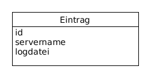

# Infinite Monitoring Tool
## Pflichtenheft

---

Fachhochschule Bielefeld, Campus Minden

Studiengang Informatik

Beteiligte Personen:

Name                   | Matrikelnummer
---------------------- | ---------------
Devin-Alexander Meier  | 1087170
Daniel Nagel           | 1085754

24.April 2018

---

# 1 Einführung

## 1.1 Beschreibung

Das 'Infinite Monitoring Tool' (kurz IMT) wird ein Skalierbares Monitoring Tool zur Überwachung von einer beliebigen Anzahl von Servern über eine dynamische und moderne Weboberfläche. Das sammeln der Serverdaten wird durch ein Skript realisiert. Dieses soll sein Plattformunabhängig und für den Endnutzer ohne viel Aufwand in betrieb genommen werden. Die Empfangen Daten des 'Daten-Sammlers' werden als Server in der Weboberfläche erkannt und automatisch dargestellt.

Der Daten 'Daten-Sammler', sowie die Webanwendung, sollen an die jeweiligen Bedürfnisse des Nutzers angepasst werden können. Die Bestandteile der Software sollen aber auch ohne weitere zu tun, mit den Standard Daten, direkt in Betrieb genommen werden können.

Das Infinite Monitoring Tool wird im weiteren Verlauf des Dokuments abgekürzt IMT genannt.

## 1.2 Ziele

### Anwendungsbereiche

Die Software soll überall dort eingesetzt werden, wo auch Computersysteme zum Einsatz kommen. D.h. ein Kleines Unternehmen mit einem IT-Administrator, welcher einen Server und fünf Clients betreut, soll mit dem System arbeiten können, genauso wie ein Großkonzern mit einer großen IT-Abteilung, welche mehrere hundert Server und unzählige Clients überwacht.

### Motivation

Durch das arbeiten in einem Mittelständischen Unternehmen mit mehreren Tochterunternehmen, welches zu den Arbeitszeiten eine hohe Verfügbarkeit hat, habe ich, Daniel Nagel, festgestellt das eine individuelle, anpassbare und problemlos skalierbare Monitoring Lösung auf dem Markt gebraucht wird.

### Umfang

#### Rich-Client-Webanwendung

Die Rich-Client-Webanwendung soll alle Daten eines Servers möglichst detailliert darstellen, aber gleichzeitig die Zustände aller anderen verbundenen Server in einfacher Weise darstellen, etwa mittels eines Farbcodes (Grün ist Gut, Rot ist schlecht).

#### Datensammler

Der Datensammler ist eine Anwendung welche auf einem zu überwachenden System zum Einsatz kommt. Dieser sammelt alle Relevanten Daten und sendet diese in regelmäßigen Zeitabständen an den Webserver.

#### Webserver

Der Webserver registriert neue Server und teilt dies dem Frontend mit. Neue Daten von bereits registrierten Servern werden an das Frontend zur Darstellung  weitergeleitet.

#### Optionale Anforderungen

 Die detaillierte Darstellung soll jederzeit an die eigenen Bedürfnisse angepasst werden können. Weiterhin sollen über die Weboberfläche die Datensammler erweitert werden könne, z.B. um Skripts welche Informationen spezieller Hardware auslesen, etwa ein Temperatursensor.

### Marktanforderungen

Das System hängt davon ab, dass die Unternehmen von ihrer IT abhängig sind. Durch die angestrebte hohe Anpassbarkeit und Skalierbarkeit wird das fertige System neuen und bestehenden Marktanforderungen gerecht.

### Alleinstellungsmerkmale

Wie bereits im Unterpunkt _Marktanforderungen_ erwähnt, wird eine hohe Anpassbarkeit und Skalierbarkeit angestrebt. Viele Monitoring Systeme sind an Windows Umgebungen angepasst, also nicht Plattformunabhängig wie IMT. Die Benutzeroberfläche anderer Systeme ist veraltet. Die Oberflächen sehen aus wie es zum Anfang der Jahrtausendwende üblich war. Zu viel Informationen auf zu wenig Platz. Das IMT soll die Informationen sehr übersichtlich, modern und sauber darstellen. Die Oberfläche das IMT soll, anders wie bei der bereits verfügbaren Software, an die Bedürfnisse des Endnutzers angepasst werden können.

### Zielbenutzergruppen

Die Zielbenutzergruppe vom IMT sind IT-Abteilung von kleinen bis großen Unternehmen. Die Aufgabe einer IT-Abteilung ist es, den täglichen betrieb der Systeme aufrecht zu erhalten. Dabei wird das IMT helfen. Das IMT setzt also voraus das die Benutzer mit Computersystemen umgehen können, um zu verstehen welche dargestellten Informationen als kritisch einzustufen sind. Durch die mögliche Erweiterbarkeit werden ebenfalls Erfahrung in der Programmierung von Skriptsprachen vorausgesetzt.

### Abgrenzung

Das IMT ist kein Ressourcenmonitor für einen Client. Es wird vorausgesetzt, dass die Umgebung mehrere zu überwachende Systeme beinhaltet. Außerdem muss durch den Benutzer festgelegt werden wann eine Ressource einen kritischen Wert erreicht oder kritische Informationen besonders hervorgehoben werden sollen. Das IMT kann keine Probleme lösen, sondern nur auf diese Aufmerksam machen.

# 2 Anforderungen

## 2.1 Funktionale Anforderungen

#### Use-Case-Diagramme

#### Rich-Client-Webanwendung
* Konfigurierbarkeit der Anwendung.
* Neu registrierte Server sollen ohne weiteres zu tun des Nutzers hinzugefügt werden.

#### Datensammler
* Möglichst Ressourcenschonend.
* Erweiterbarkeit.

#### Webserver
* Registrieren neuer Server.
* Weiterleiten neuer Informationen an das Frontend.

## 2.2 Nicht-funktionale Anforderungen

#### Rich-Client-Webanwendung
* Selbsterklärende GUI der Anwendung.
* Intuitive Darstellung der Informationen
  für einen schnellen Überblick für das
  wesentliche.

#### Datensammler
* Daten sollen in normalisierter Form weitergegeben werden.

### 2.2.1 Rahmenbedingungen
    - Normen, Standards, Protokolle, Hardware, externe Vorgaben

### 2.2.2 Betriebsbedingungen
* Das System soll mit den neuesten Technologien betrieben werden:
  * Node.js im Backend.
  * React.js im Frontend.
  * JEST und Jasmine zum Testen.

### 2.2.3 Qualitätsmerkmale
    - Externe Qualitätsanforderungen (z.B. Performance, Sicherheit, Zuverlässigkeit, Benutzerfreundlichkeit)

## 2.3 Graphische Benutzerschnittstelle

    - GUI-Mockups passend zu User Stories
    - Modellierung der Navigation zwischen den Screens der GUI-Mockups als Zustandsdiagramm

## 2.4 Anforderungen im Detail
    - User Stories mit Akzeptanzkritierien
    - Optional: Name (oder ID) und Priorität ("Must", "Should", "Could", "Won't")
    - Strukturierung der User Stories in funktionale Gruppen

### User Stories

#### Rich-Client-Webanwendung

| **Als** | **möchte ich** | **so dass** | **Akzeptanz** |
| :------ | :----- | :------ | :-------- |
| Benutzer | eine intuitive Oberfläche der Anwendung angezeigt bekommen | die Überwachung der Systeme einfach ist | keine Dokumentation lesen müssen |
| Benutzer | optisches Feedback zum Zustand der registrierten Server bekommen | schnell reagiert werden kann | selbst ein Laie erkannt das etwas nicht stimmt |
| Benutzer | Vorkonfigurierte Datensammler und Webanwendungen angeboten bekommen | Zeit bei inbetriebnahme eingespart wird. | Kennenlernen des Systems, ohne diese erst "aufbauen" zu müssen. |
| Benutzer | die Oberfläche verändern können | diese an meine speziellen Anforderungen angepasst ist | das System zeigt genau und nur die Informationen die ich brauche. |

#### Datensammler

| **Als** | **möchte ich** | **so dass** | **Akzeptanz** |
| :------ | :----- | :------ | :-------- |
| Benutzer | den Datensammler direkt starten können | dieser vorher nicht noch konfiguriert werden muss | Zeit sparen |
| Benutzer | sicherstellen können das alle Informationen die ich brauche gesammelt werden | keine wichtigen Informationen verloren gehen | alle relevanten Daten kommen an der Weboberfläche an |
| Benutzer | den Datensammler erweitern können | spezielle Informationen gesammelt werden können | alle relevanten Daten kommen an der Weboberfläche an |
| Benutzer | einen Ressourcenschonenden Datensammler haben | keine wichtigen Ressourcen verbraucht werden | der Betrieb des Datensammlers fällt nicht auf |

#### Webserver

| **Als** | **möchte ich** | **so dass** | **Akzeptanz** |
| :------ | :----- | :------ | :-------- |
| Benutzer | eine automatische Verbindung zwischen Sammlern und Rich-Client-Webanwendung haben | keine Zeit bei der Konfiguration verloren geht | neue Server werden an der Oberfläche sofort regsitriert |

# 3 Technische Beschreibung

## 3.1 Systemübersicht
    - Systemarchitekturdiagramm ("Box-And-Arrow" Diagramm)
    - Schnittstellenbeschreibung
    - Kommunikationsprotokolle, Datenformate

## 3.2 Softwarearchitektur
    - Darstellung von Softwarebausteinen (Module, Schichten, Komponenten)

Das obige Diagramm stellt die Systemarchitektur dar. Auf der linken Seite des Diagramms wird die Rich-Client-Webanwendung über einen Webbrowser aufgerufen. Über das Netzwerk wird eine Verbindung mit dem Webserver hergestellt. Auf der rechten Seite befinden sich beliebig viele Server welche einen Datensammel Prozess laufen lassen. Der Webserver erkennt jeden Datensammel Prozess und gibt die Daten an die Rich-Client-Webanwendung zur Darstellung weiter.

## 3.3 Datenmodell
    - Konzeptionelles Analyseklassendiagramm

Das obige Diagramm zeigt das Schema der NoSQL Datenbank auf dem Webserver. Die Datenbank hält alte Daten zu je einem registrierten Server bereit für Analytische Zwecke und zum vergleichen der Daten über einen gewissen Zeitraum hinweg.

## 3.4 Abläufe
    - Aktivitätsdiagramme für relevante Use Cases
    - Aktivitätsdiagramm für den Ablauf sämtlicher Use Cases

## 3.5 Entwurf
    - Detaillierte UML-Diagramme für relevante Softwarebausteine

# 4 Projektorganisation

## 4.1 Annahmen
    - Nicht durch den Kunden definierte spezifische Annahmen, Anforderungen und Abhängigkeiten
    - Verwendete Technologien (Programmiersprache, Frameworks, etc.)
    - Einschränkungen, Betriebsbedingungen und Faktoren, die die Entwicklung beeinflussen (Betriebssysteme, Entwicklungsumgebung)
    - Interne Qualitätsanforderungen (z.B. Softwarequalitätsmerkmale wie z.B. Erweiterbarkeit)

## 4.2 Verantwortlichkeiten
    - Zuordnung von Personen zu Softwarebausteinen aus Kapitel 3.1 und 3.2
    - Rollendefinition und Zuordnung

## 4.3 Grober Projektplan
    - Meilensteine

# 5 Anhänge

## 5.1 Glossar
    - Definitionen, Abkürzungen, Begriffe

## 5.2 Referenzen
    - Handbücher, Gesetze

## 5.3 Index
