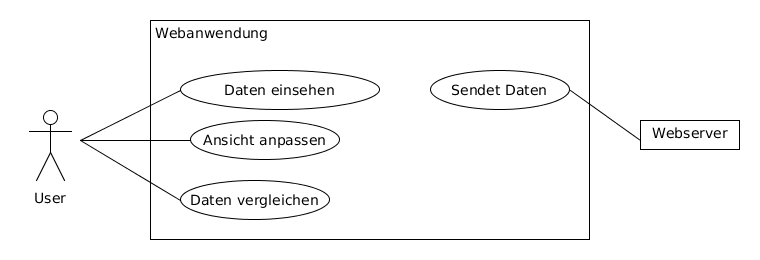

# Infinite Monitoring Tool
## Pflichtenheft

---

Fachhochschule Bielefeld, Campus Minden

Studiengang Informatik

Beteiligte Personen:

Name                   | Matrikelnummer
---------------------- | ---------------
Devin-Alexander Meier  | 1087170
Daniel Nagel           | 1085754

24.April 2018

---

# Inhaltsverzeichnis

1. [Einführung](#1-einführung)
    1. [Beschreibung](#11-beschreibung)
    2. [Ziele](#12-ziele)
2. [Anforderungen](#2-anforderungen)
    1. [Funktionale Anforderungen](#21-funktionale-anforderungen)
    2. [Nicht Funktionale Anforderungen](#22-nicht-funktionale-anforderungen)
        1. [Rahmenbedingungen](#221-rahmenbedingungen)
        2. [Betriebsbedingungen](#222-betriebsbedingungen)
        3. [Qualitätsmerkmale](#223-qualitätsmerkmale)
    3. [Graphische Benutzerschnittstelle](#23-graphische-benutzerschnittstelle)
    4. [Anforderungen im Detail](#24-anforderungen-im-detail)
3. [Technische Beschreibung](#3-technische-beschreibung)
    1. [Systemübersicht](#31-systemübersicht)
    2. [Softwarearchitektur](#32-softwarearchitektur)
    3. [Datenmodell](#33-datenmodell)
    4. [Abläufe](#34-abläufe)
    5. [Entwurf](#35-entwurf)
4. [Projektorganisation](#4-projektorganisation)
    1. [Annahmen](#41-annahmen)
    2. [Verantwortlichkeiten](#42-verantwortlichkeiten)
    3. [Grober Projektplan](#43-grober-projektplan)
5. [Anhänge](#5-anhänge)
    1. [Glossar](#51-glossar)
    2. [Referenzen](#52-referenzen)

---

# 1 Einführung

## 1.1 Beschreibung

Das 'Infinite Monitoring Tool' (kurz IMT) wird ein Skalierbares Monitoring Tool zur Überwachung von einer beliebigen Anzahl von Servern über eine dynamische und moderne Weboberfläche. Das sammeln der Serverdaten wird durch ein Skript realisiert. Dieses soll Plattformunabhängig sein und für den Endnutzer ohne viel Aufwand in Betrieb genommen werden. Die Empfangen Daten des 'Daten-Sammlers' werden als Server in der Weboberfläche erkannt und automatisch dargestellt.

Der Daten 'Daten-Sammler', sowie die Webanwendung, sollen an die jeweiligen Bedürfnisse des Nutzers angepasst werden können. Die Bestandteile der Software sollen aber auch ohne weitere zu tun, mit den Standard Daten, direkt in Betrieb genommen werden können.

Das Infinite Monitoring Tool wird im weiteren Verlauf des Dokuments abgekürzt IMT genannt.

## 1.2 Ziele

### Anwendungsbereiche

Die Software soll überall dort eingesetzt werden, wo auch Computersysteme zum Einsatz kommen. D.h. ein Kleines Unternehmen mit einem IT-Administrator, welcher einen Server und fünf Clients betreut, soll mit dem System arbeiten können, genauso wie ein Großkonzern mit einer großen IT-Abteilung, welche mehrere hundert Server und unzählige Clients überwacht.

### Motivation

Durch das arbeiten in einem Mittelständischen Unternehmen mit mehreren Tochterunternehmen, welches zu den Arbeitszeiten eine hohe Verfügbarkeit hat, habe ich, Daniel Nagel, festgestellt das eine individuelle, anpassbare und problemlos skalierbare Monitoring Lösung auf dem Markt gebraucht wird.

### Umfang

#### Webanwendung

Die Webanwendung soll alle Daten eines Servers möglichst detailliert darstellen, aber gleichzeitig die Zustände aller anderen verbundenen Server in einfacher Weise darstellen, etwa mittels eines Farbcodes (Grün ist Gut, Rot ist schlecht).

#### Datensammler

Der Datensammler ist eine Anwendung welche auf einem zu überwachenden System zum Einsatz kommt. Dieser sammelt alle Relevanten Daten und sendet diese in regelmäßigen Zeitabständen an den Webserver.

#### Webserver

Der Webserver registriert neue Server und teilt dies dem Frontend mit. Neue Daten von bereits registrierten Servern werden an das Frontend zur Darstellung  weitergeleitet.

#### Optionale Anforderungen

 Die detaillierte Darstellung soll jederzeit an die eigenen Bedürfnisse angepasst werden können. Weiterhin sollen über die Weboberfläche die Datensammler erweitert werden könne, z.B. um Skripts welche Informationen spezieller Hardware auslesen, etwa ein Temperatursensor.

### Marktanforderungen

Das System hängt davon ab, dass die Unternehmen von ihrer IT abhängig sind. Durch die angestrebte hohe Anpassbarkeit und Skalierbarkeit wird das fertige System neuen und bestehenden Marktanforderungen gerecht.

### Alleinstellungsmerkmale

Wie bereits im Unterpunkt _Marktanforderungen_ erwähnt, wird eine hohe Anpassbarkeit und Skalierbarkeit angestrebt. Viele Monitoring Systeme sind an Windows Umgebungen angepasst, also nicht Plattformunabhängig wie IMT. Die Benutzeroberfläche anderer Systeme ist veraltet. Die Oberflächen sehen aus wie es zum Anfang der Jahrtausendwende üblich war. Zu viel Informationen auf zu wenig Platz. Das IMT soll die Informationen sehr übersichtlich, modern und sauber darstellen. Die Oberfläche das IMT soll, anders wie bei der bereits verfügbaren Software, an die Bedürfnisse des Endnutzers angepasst werden können.

### Zielbenutzergruppen

Die Zielbenutzergruppe vom IMT sind IT-Abteilung von kleinen bis großen Unternehmen. Die Aufgabe einer IT-Abteilung ist es, den täglichen betrieb der Systeme aufrecht zu erhalten. Dabei wird das IMT helfen. Das IMT setzt also voraus das die Benutzer mit Computersystemen umgehen können, um zu verstehen welche dargestellten Informationen als kritisch einzustufen sind. Durch die mögliche Erweiterbarkeit werden ebenfalls Erfahrung in der Programmierung von Skriptsprachen vorausgesetzt.

### Abgrenzung

Das IMT ist kein Ressourcenmonitor für einen Client. Es wird vorausgesetzt, dass die Umgebung mehrere zu überwachende Systeme beinhaltet. Außerdem muss durch den Benutzer festgelegt werden wann eine Ressource einen kritischen Wert erreicht oder kritische Informationen besonders hervorgehoben werden sollen. Das IMT kann keine Probleme lösen, sondern nur auf diese Aufmerksam machen.

[Zurück zum Anfang](#infinite-monitoring-tool)

# 2 Anforderungen

## 2.1 Funktionale Anforderungen

#### Use-Case-Diagramme

#### Webanwendung
* Konfigurierbarkeit der Anwendung.
* Neu registrierte Server sollen ohne weiteres zu tun des Nutzers hinzugefügt werden.

#### Datensammler
* Möglichst Ressourcenschonend.
* Erweiterbarkeit.

#### Webserver
* Registrieren neuer Server.
* Weiterleiten neuer Informationen an das Frontend.

## 2.2 Nicht-funktionale Anforderungen

#### Webanwendung
* Selbsterklärende GUI der Anwendung.
* Intuitive Darstellung der Informationen
  für einen schnellen Überblick für das
  wesentliche.

#### Datensammler
* Daten sollen in normalisierter Form weitergegeben werden.

### 2.2.1 Rahmenbedingungen

#### Standards
* Der verwendete Standard des Softwaresystems sind Sockets. Mithilfe der Sockets wird ein durchgehende Verbindung aufrecht erhalten. Datensammler, sowie Webanwendung sind üer einen Socket mit dem Webserver verbunden.

#### Protokolle
* Das für  die Datenübertragung Verwendete Protokoll ist TCP (Transmission Control Protocol)

#### Hardware
* Die minimale Hardware Anforderungen für das Softwaresystem ist ein einziger Computer. Auf dem Computer würde ein Datensammler sowie der Webserver laufen. Der Datensammler sendet die Daten an den Webserver. Der Webserver sendet dann die Daten an die Weboberfläche die dann in einem Browser aufgerufen werden kann.
* Geplant ist ein Webserver welcher eine große Menge von Socketverbindungen verarbeiten kann. Es soll keine Beschränkung in der Menge von zu überwachenden Servern geben. Genau so soll es keine Beschränkung in der Anzahl der Clients geben die eine Webanwendung anfordern.

### 2.2.2 Betriebsbedingungen
* Das System soll mit den neuesten Technologien betrieben werden:
  * Node.js im Backend.
  * React.js im Frontend.
  * JEST, Jasmine, Mocha und Chai zum Testen.

### 2.2.3 Qualitätsmerkmale

#### Performance
* Das Softwaresystem hat eine hohe Qualitätsanforderung an die Performance. Es sollen, wie der Name schon sagt, unendlich viele Computersysteme überwacht werden können.

#### Sicherheit
* Je nach Art der Daten steigt die Anforderung an die Sicherheit. Daher sollten alle Teile des Software Systems ihre Übertragung mit SSL verschlüßeln können.

#### Zuverlässigkeit
* Da die überwachung der Systeme nicht für den Alltäglichen Betrieb benötigt wird, kann das System ausfallen, ohne das ein großer Schaden entsteht.

#### Benutzerfreundlichkeit
* Da die Webanwendung eine große Menge an Daten darstellt, sollten diese möglichst effizient und übersichtlich dargestellt werden.
* Die Erweiterbarkeit sollte möglichst Individuell sein, daher liegt der Fokus hier auf den Umfang der Möglichen Erweiterbarkeit und weniger auf der Benutzerfreundlichkeit.

## 2.3 Graphische Benutzerschnittstelle

    - GUI-Mockups passend zu User Stories
    - Modellierung der Navigation zwischen den Screens der GUI-Mockups als Zustandsdiagramm

## 2.4 Anforderungen im Detail

### User Stories

#### Webanwendung

| **Als** | **möchte ich** | **so dass** | **Akzeptanz** |
| :------ | :----- | :------ | :-------- |
| Benutzer | eine intuitive Oberfläche der Anwendung angezeigt bekommen | die Überwachung der Systeme einfach ist | keine Dokumentation lesen müssen |
| Benutzer | optisches Feedback zum Zustand der registrierten Server bekommen | schnell reagiert werden kann | selbst ein Laie erkannt das etwas nicht stimmt |
| Benutzer | Vorkonfigurierte Datensammler und Webanwendungen angeboten bekommen | Zeit bei inbetriebnahme eingespart wird. | Kennenlernen des Systems, ohne diese erst "aufbauen" zu müssen. |
| Benutzer | die Oberfläche verändern können | diese an meine speziellen Anforderungen angepasst ist | das System zeigt genau und nur die Informationen die ich brauche. |

#### Datensammler

| **Als** | **möchte ich** | **so dass** | **Akzeptanz** |
| :------ | :----- | :------ | :-------- |
| Benutzer | den Datensammler direkt starten können | dieser vorher nicht noch konfiguriert werden muss | Zeit sparen |
| Benutzer | sicherstellen können das alle Informationen die ich brauche gesammelt werden | keine wichtigen Informationen verloren gehen | alle relevanten Daten kommen an der Weboberfläche an |
| Benutzer | den Datensammler erweitern können | spezielle Informationen gesammelt werden können | alle relevanten Daten kommen an der Weboberfläche an |
| Benutzer | einen Ressourcenschonenden Datensammler haben | keine wichtigen Ressourcen verbraucht werden | der Betrieb des Datensammlers fällt nicht auf |

#### Webserver

| **Als** | **möchte ich** | **so dass** | **Akzeptanz** |
| :------ | :----- | :------ | :-------- |
| Benutzer | eine automatische Verbindung zwischen Sammlern und Webanwendung haben | keine Zeit bei der Konfiguration verloren geht | neue Server werden an der Oberfläche sofort regsitriert |

[Zurück zum Anfang](#infinite-monitoring-tool)

# 3 Technische Beschreibung

## 3.1 Systemübersicht

Das obige Diagramm stellt die Systemarchitektur dar. Auf der linken Seite des Diagramms wird die Webanwendung über einen Webbrowser aufgerufen. Es wird ein Socket zum Webserver geöffnet. Dieser sendet, per HTTP, durchgehend die neuesten Daten der Datensammler an die Webanwendung, ohne das die Webanwendung neue Daten anfordern muss. Auf der rechten Seite befinden sich beliebig viele Server welche einen Datensammler Prozess laufen lassen. Diese erstellen ebenfalls einen Socket zum Webserver. Der Datensammler sendet, per TCP, durchgehend neue Daten an den Webserver. Dieser erkennt jeden Datensammler als neues Computersystem und gibt die Daten, über den offenen Socket an die Webanwendung zur Darstellung weiter.

## 3.2 Softwarearchitektur

### Komponenten

#### Webanwendung

* Die Webanwendung stellt alle Daten eines Servers möglichst detailliert dar.

#### Datensammler

* Der Datensammler ist eine Anwendung welche auf einem zu überwachenden System zum Einsatz kommt. Dieser sammelt alle Relevanten Daten und sendet diese in regelmäßigen Zeitabständen an den Webserver.

#### Webserver

* Der Webserver dient als Vermittler zwischen Datensammler und Webanwendung.

### Schichten

#### Socketverbindungen

* Die Socketverbindungen arbeiten auf folgenden Schichten:
  * Datensammler -> Webserver (TCP)
  * Webserver -> Webanwendung (HTTP)

## 3.3 Datenmodell

Der konzeptionelle  Entwurf der Implementierung aller Bestandteile des Softwaresystems.

#### Webanwendung

Die Webanwendung  wird durch einen Handler gesteuert der die Logik überwacht. Alle Elemente der Webanwendung erben von der UIObject Klasse.

#### Datensammler

Der Datensammler besitzt  eine Klasse die die Verbindung zum Webserver herstellt (Binder). Außerdem noch den Scraper selber, welcher die zu sammlenden Daten als Source kennt. Eine Source hat einen SourceType, welcher festlegt welche Art von Daten diese Quelle hat. Die Quellen sollen über eine formatierte Datei eingeladen werden können.

#### Webserver

Der Webserver stellt die Verbindung zu allen Datensammlern und allen Webanwendungen her (Binder). Der Webserver verwaltet alle Datensammler in einem Scraper Objekt.

## 3.4 Abläufe

Die folgenden Aktivitätsdiagramme zeigen die Abläufe aller Komponenten des Softwaresystems.

#### Webanwendung

#### Datensammler

#### Webserver

## 3.5 Entwurf

Die folgenden UML-Diagramme konkretisieren die zuvor beschriebenen konzeptionellen UML-Diagramme des Softwaresystems.

#### Webanwendung

Die Webanwendung  wird durch einen Handler gesteuert der die Logik überwacht. Der Handler überprüft ebenfalls die Formatierung der Daten. Alle Elemente der Webanwendung erben von der UIObject Klasse. Ein besonderes UIObject ist der MiniServer. Dieser stellt die anderen Server der Weboberfläche dar die aktuell nicht im Fokus stehen. Anhand anpassbarer kritischer Werte, wird ein Status berechnet der das Objekt entsprechend einfärbt und den Nutzer  mit einem Sound auf sich Aufmerksam macht. Es wird eine Benutzeroberfläche anhand der Empfangen Daten erstellt. Optional können andere Daten angezeigt, z.B. die aktuelle Uhrzeit, oder die Empfangen Daten ausgeblendet werden.

#### Datensammler

Der Datensammler besitzt  eine Klasse die die Verbindung zum Webserver herstellt (Binder). Dieser verbindet sich zu genau einem Server. Der Scraper sammelt die Daten. Dazu überprüft er die Sourcen und lädt eine formatierte Quellendatei ein. Eine Source ist die zu beschaffende Ressource, welche in der zuvor erwänten Quellendatei konkretisiert wird. Eine Source hat einen SourceType, welcher festlegt welche Art von Daten diese Quelle hat. Diese Information nutzt die Webanwendung, um zu erkennen welches UIObject das passende für diese Ressource ist.

#### Webserver

Der Webserver stellt die Verbindung zu allen Datensammlern und allen Webanwendungen her (Binder). Die registrierten Scraper werden in einem Array gesichert. Der Webserver verwaltet alle Datensammler in einem Scraper Objekt. Das Scraper Objekt beinhaltet eine IP-Adresse, einen Zeitstempel und die aktuellen Daten.

[Zurück zum Anfang](#infinite-monitoring-tool)

# 4 Projektorganisation

## 4.1 Annahmen

### Technologien

#### Programmiersprachen

 * JavaScript
 * TypeScript
 * Python

#### Frameworks

 * NodeJS
   * SocketIO
   * Webpack
   * JEST
   * Jasmine
   * Mocha
 * ReactJS
   * JEST
 * Babel
 * Python
   * Psutil

#### Entwicklung
 * Atom IDE
 * Travis CI
 * PIP
 * npm

#### Einschränkungen
 * Die Plattformunabhängigkeit kann während des Entwicklungsprozesses zu Problemen führen.

#### Qualitätsanforderungen
 * Erweiterbarkeit der Webanwendung und des Datensammlers.

## 4.2 Verantwortlichkeiten

### Rollendefinition

#### Projektleitung und Entwicklung
* Daniel Nagel

#### Entwicklung
* Devin-Alexander Meier

### Zuordnung

#### Webanwendung
* Devin-Alexander Meier

#### Datensammler
* Daniel Nagel
* Devin-Alexander Meier

#### Webserver
* Daniel Nagel

## 4.3 Grober Projektplan

[Zurück zum Anfang](#infinite-monitoring-tool)

# 5 Anhänge

## 5.1 Glossar
* __IMT__ - Infinite Monitoring Tool
* __PIP__ - "pip installs packages", früher pyinstall
* __npm__ - Node Package Manager

## 5.2 Referenzen
    - Handbücher, Gesetze

[Zurück zum Anfang](#infinite-monitoring-tool)
